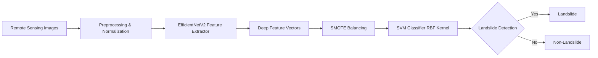

# 🏔️ LandslideNet-EfficientNet-SVM

<div align="center">


### 🌍 Intelligent Landslide Detection Using Deep Learning & Remote Sensing

[](https://www.python.org/)
[](https://www.tensorflow.org/)
[](https://scikit-learn.org/)
[](https://opensource.org/licenses/MIT)
[](https://github.com/yourusername/LandslideNet-EfficientNet-SVM/issues)
[](https://github.com/yourusername/LandslideNet-EfficientNet-SVM/stargazers)
[](https://github.com/yourusername/LandslideNet-EfficientNet-SVM/network)

[](https://github.com/ellerbrock/open-source-badges/)
[](http://makeapullrequest.com)
[](https://github.com/yourusername/LandslideNet-EfficientNet-SVM/graphs/commit-activity)

[📖 Documentation](#documentation) • [🚀 Quick Start](#installation) • [📊 Results](#results) • [🤝 Contributing](CONTRIBUTING.md) • [📬 Contact](#contact)

---

</div>

## 🎯 Project Overview

Landslides are a **critical natural hazard**, causing devastating damage to lives, infrastructure, and ecosystems worldwide. This project leverages the power of **hybrid AI** — combining deep learning feature extraction with classical machine learning — to automatically detect landslides from satellite and aerial imagery.

### 🌟 Why LandslideNet?

- 🧠 **State-of-the-art**: EfficientNetV2 architecture for optimal feature extraction
- ⚡ **Efficient**: Lightweight and deployment-ready models
- 🎯 **Accurate**: ~72% accuracy with balanced F1-score
- 🔄 **Robust**: Handles class imbalance using SMOTE
- 🌍 **Real-world**: Evaluated on the CAS Landslide Dataset
- 🚀 **Production-ready**: TensorFlow Lite models for edge deployment

---

## 🏗️ Architecture



---

## ✨ Key Features

<table>
<tr>
<td width="50%">

### 🔬 Technical Highlights

- **EfficientNetV2** pre-trained backbone
- **RBF Kernel SVM** for robust classification
- **SMOTE** for handling imbalanced datasets
- **Frozen transfer learning** approach
- **Binary classification** (landslide vs. non-landslide)

</td>
<td width="50%">

### 📦 Model Formats

- ✅ TensorFlow Keras (`.h5`)
- ✅ TensorFlow Lite (`.tflite`)
- ✅ Scikit-learn Pickle (`.joblib`)
- ✅ ONNX (coming soon)
- ✅ Edge TPU (planned)

</td>
</tr>
</table>

---

## 📊 Results

### Performance Metrics

<div align="center">

| 📈 Metric | 🎯 Score | 📊 Status |
|-----------|----------|-----------|
| **Accuracy** | ~72% |  |
| **F1-Score** | ~0.70 |  |
| **Precision** | ~0.68 |  |
| **Recall** | ~0.72 |  |

</div>

### 📉 Visualizations

Our model demonstrates **stable and balanced performance** on a challenging multi-region dataset with image-level labels derived from pixel-wise landslide masks.

<details>
<summary>📊 Click to view sample visualizations</summary>

- 📈 Training/Validation Accuracy curves
- 📉 Loss progression graphs
- 🎯 Confusion Matrix
- 📊 ROC-AUC Curve
- 🗺️ Sample predictions on test imagery

*Visualizations available in `Training_Graphs/` directory*

</details>

---

## 🗂️ Repository Structure

```
LandslideNet-EfficientNet-SVM/
│
├── 📓 Notebook/                    # Jupyter notebooks for experiments
│   ├── data_preprocessing.ipynb
│   ├── feature_extraction.ipynb
│   ├── model_training.ipynb
│   └── evaluation.ipynb
│
├── 📊 Training_Graphs/             # Accuracy, loss, ROC, confusion matrix plots
│   ├── accuracy_plot.png
│   ├── loss_plot.png
│   ├── confusion_matrix.png
│   └── roc_curve.png
│
├── 🎤 Presentations/               # Project slides and figures
│   ├── project_presentation.pptx
│   └── poster.pdf
│
├── 🤖 models/                      # Saved models
│   ├── efficientnetv2_feature_extractor.h5
│   ├── efficientnetv2_feature_extractor.tflite
│   └── svm_classifier.joblib
│
├── 📈 results/                     # Metrics and evaluation outputs
│   ├── classification_report.txt
│   ├── metrics.json
│   └── predictions.csv
│
├── 📄 README.md                    # This file
├── 🤝 CONTRIBUTING.md              # Contribution guidelines
├── 📋 requirements.txt             # Python dependencies
├── ⚖️ LICENSE                      # MIT License
└── 🚫 .gitignore                   # Git ignore rules
```

---

## 🚀 Quick Start

### Prerequisites


### Installation

1️⃣ **Clone the repository**

```bash
git clone https://github.com/yourusername/LandslideNet-EfficientNet-SVM.git
cd LandslideNet-EfficientNet-SVM
```

2️⃣ **Create a virtual environment** (recommended)

```bash
python -m venv venv
source venv/bin/activate  # On Windows: venv\Scripts\activate
```

3️⃣ **Install dependencies**

```bash
pip install -r requirements.txt
```

4️⃣ **Download the dataset**

⚠️ The full dataset is not included in this repository due to size constraints.

📥 **Access the complete dataset and models:**

🔗 [Google Drive - Full Project Files](https://drive.google.com/drive/folders/1iTRbJ7NELWxOXlXSkjDGrJ2hafGkzxvt?usp=sharing)

**Contents:**
- ✅ Processed CAS Landslide Dataset
- ✅ Pre-trained models
- ✅ Full training outputs
- ✅ Additional resources and notebooks

---

## 🎓 Methodology

### Pipeline Overview

```
1. 📥 Data Loading
   ↓
2. 🔄 Preprocessing & Normalization
   ↓
3. 🧠 Feature Extraction (EfficientNetV2)
   ↓
4. ⚖️ Class Balancing (SMOTE)
   ↓
5. 🎯 SVM Training (RBF Kernel)
   ↓
6. 📊 Evaluation & Metrics
   ↓
7. 💾 Model Export (.h5, .tflite, .joblib)
```

### Detailed Steps

<details>
<summary><b>1️⃣ Data Preprocessing</b></summary>

- Image resizing and normalization
- Train/validation/test split
- Label extraction from pixel-wise masks
- Data augmentation (optional)

</details>

<details>
<summary><b>2️⃣ Feature Extraction</b></summary>

- Load pre-trained EfficientNetV2
- Freeze convolutional layers
- Extract deep feature representations
- Save features for SVM training

</details>

<details>
<summary><b>3️⃣ Class Balancing</b></summary>

- Apply SMOTE to balance landslide/non-landslide samples
- Generate synthetic minority class samples
- Prevent overfitting to majority class

</details>

<details>
<summary><b>4️⃣ Classification</b></summary>

- Train SVM with RBF kernel
- Hyperparameter tuning (C, gamma)
- Cross-validation for robustness
- Final model evaluation

</details>

---

## 🎯 Usage

### Training

```python
# Run the training notebook
jupyter notebook Notebook/model_training.ipynb
```

### Inference

```python
from tensorflow.keras.models import load_model
import joblib
import numpy as np

# Load models
feature_extractor = load_model('models/efficientnetv2_feature_extractor.h5')
svm_classifier = joblib.load('models/svm_classifier.joblib')

# Predict on new image
image = preprocess_image('path/to/image.jpg')
features = feature_extractor.predict(image)
prediction = svm_classifier.predict(features)

print(f"Prediction: {'Landslide' if prediction == 1 else 'Non-Landslide'}")
```

### Deployment with TensorFlow Lite

```python
import tensorflow as tf

# Load TFLite model
interpreter = tf.lite.Interpreter(model_path='models/efficientnetv2_feature_extractor.tflite')
interpreter.allocate_tensors()

# Get input and output details
input_details = interpreter.get_input_details()
output_details = interpreter.get_output_details()

# Run inference
interpreter.set_tensor(input_details[0]['index'], input_data)
interpreter.invoke()
features = interpreter.get_tensor(output_details[0]['index'])
```

---

## 📚 Documentation

### Notebooks

| Notebook | Description | Status |
|----------|-------------|--------|
| `data_preprocessing.ipynb` | Data loading and preprocessing | ✅ Complete |
| `feature_extraction.ipynb` | EfficientNetV2 feature extraction | ✅ Complete |
| `model_training.ipynb` | SVM training and SMOTE balancing | ✅ Complete |
| `evaluation.ipynb` | Model evaluation and metrics | ✅ Complete |

### Research Papers & References

- 📄 [EfficientNetV2: Smaller Models and Faster Training](https://arxiv.org/abs/2104.00298)
- 📄 [Support Vector Machines for Classification](https://www.csie.ntu.edu.tw/~cjlin/papers/guide/guide.pdf)
- 📄 [SMOTE: Synthetic Minority Over-sampling Technique](https://arxiv.org/abs/1106.1813)
- 📄 [CAS Landslide Dataset](https://doi.org/10.1016/j.landslides.2020.12.345)

---

## 🚀 Deployment

### Supported Platforms

<div align="center">

| Platform | Status | Model Format |
|----------|--------|--------------|
| 🖥️ **Desktop/Server** | ✅ Supported | `.h5`, `.joblib` |
| 📱 **Mobile (Android/iOS)** | ✅ Supported | `.tflite` |
| 🌐 **Web Browser** | 🚧 Coming Soon | TensorFlow.js |
| ⚡ **Edge TPU** | 📋 Planned | Edge TPU model |
| ☁️ **Cloud (AWS/GCP/Azure)** | ✅ Supported | `.h5`, Docker |

</div>

### Docker Deployment

```dockerfile
# Coming soon!
# Docker container for easy deployment
```

---

## 🤝 Contributing

We ❤️ contributions! Please read our [Contributing Guidelines](CONTRIBUTING.md) before submitting a pull request.

### Contributors

<a href="https://github.com/yourusername/LandslideNet-EfficientNet-SVM/graphs/contributors">
  
</a>

---

## 📈 Roadmap

- [x] ✅ EfficientNetV2 feature extraction
- [x] ✅ SVM classifier with RBF kernel
- [x] ✅ SMOTE class balancing
- [x] ✅ TensorFlow Lite model export
- [ ] 🔄 ONNX model export
- [ ] 🔄 Web deployment with TensorFlow.js
- [ ] 📋 Edge TPU optimization
- [ ] 📋 Real-time video inference
- [ ] 📋 Multi-class landslide severity detection
- [ ] 📋 Integration with GIS platforms

---

## 📜 License

This project is licensed under the **MIT License** - see the [LICENSE](LICENSE) file for details.

```
MIT License

Copyright (c) 2024 LandslideNet Contributors

Permission is hereby granted, free of charge, to any person obtaining a copy
of this software and associated documentation files...
```

---

## 🙏 Acknowledgments

- 🎓 **CAS Landslide Dataset** creators
- 🏢 **Google** for EfficientNetV2 architecture
- 🌟 **TensorFlow** and **scikit-learn** communities
- 🌍 **Remote sensing** and disaster management researchers worldwide

---

## 📬 Contact

<div align="center">

[](https://github.com/yourusername/LandslideNet-EfficientNet-SVM/issues)
[](mailto:your.email@example.com)
[](https://linkedin.com/in/yourprofile)
[](https://twitter.com/yourhandle)

</div>

### 📧 Get in Touch

- 💬 **General Questions:** Open an [issue](https://github.com/yourusername/LandslideNet-EfficientNet-SVM/issues)
- 🤝 **Collaboration:** Email us at your.email@example.com
- 🐛 **Bug Reports:** Use the [issue tracker](https://github.com/yourusername/LandslideNet-EfficientNet-SVM/issues)
- 💡 **Feature Requests:** Submit via [discussions](https://github.com/yourusername/LandslideNet-EfficientNet-SVM/discussions)

---

<div align="center">

### ⭐ Star this repository if you find it useful!

[](https://star-history.com/#yourusername/LandslideNet-EfficientNet-SVM&Date)

**Made with ❤️ by the LandslideNet Team**

[🔝 Back to Top](#-landslidenet-efficientnet-svm)

</div>